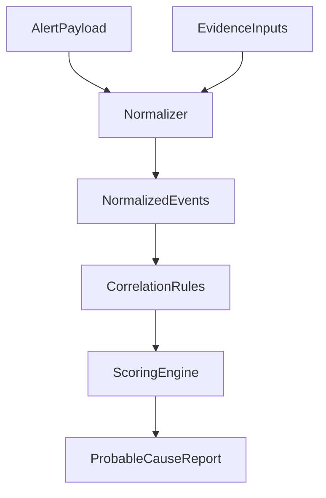

## Architecture (documentation-first)

This document describes the **intended MVP architecture** and the incremental path to later phases. It is deliberately implementation-agnostic and focuses on **data contracts**, **flow**, and **responsibilities**.

### MVP outcome

Given an incident affecting **Azure VM → on-prem endpoint** connectivity, produce a **probable-cause summary** backed by evidence.

### High-level components

- **IncidentInput**: a structured “alert payload” describing the VM, endpoint, time window, and symptoms.
- **EvidenceSources**: structured evidence events relevant to the incident window.
  - Phase 1: mock JSON
  - Phase 2: read-only Log Analytics (KQL)
  - Phase 3: diagnostic evidence collection (still read-only)
- **Normalizer**: converts evidence from various sources into a consistent internal event model.
- **CorrelationRules**: deterministic rules that map evidence to hypotheses and scoring.
- **ScoringEngine**: computes confidence scores and selects top hypotheses.
- **ReportGenerator**: produces a short, IT-admin-friendly report.

### Data flow

### Core data contracts (MVP-level)

#### AlertPayload (conceptual fields)

- **incidentId**: string (optional)
- **timeWindow**: start/end timestamps
- **azureVm**: name/resourceId, subscription (placeholder values allowed)
- **onPremEndpoint**: ipOrFqdn, ports/protocols (optional)
- **symptoms**: list (loss/latency/unreachable/port-specific)

#### NormalizedEvent (conceptual fields)

- **timestamp**
- **source**: activity/telemetry/diagnostic
- **category**: nsg/udr/gateway/dns/firewall/unknown
- **resourceId**: Azure resource reference (when applicable)
- **summary**: short human-readable description
- **attributes**: key/value details (kept minimal in MVP)

#### Hypothesis (MVP set)

The MVP should start with a small, practical set such as:

- **Recent NSG change impacted traffic**
- **Recent route/UDR change altered path**
- **VPN/ExpressRoute gateway degradation**
- **Name resolution/DNS issue**
- **On-prem firewall change or block**
- **Insufficient evidence / unknown**

### Rule-based correlation (Phase 1)

Rules should be:

- Deterministic and explainable (“if evidence A and symptom B, increase score for hypothesis H”)
- Conservative with confidence when evidence is missing or ambiguous
- Able to attach “supporting evidence” and “contradicting evidence”

### Evidence model by phase

- **Phase 1 (mock)**:
  - Static JSON fixtures for activity changes and telemetry markers
  - Pre-baked “diagnostic summaries” as evidence events
- **Phase 2 (read-only Azure)**:
  - KQL queries to fetch:
    - Activity changes near the incident window
    - Relevant network telemetry signals (where available)
- **Phase 3 (evidence collection)**:
  - Runbooks/scripts to collect diagnostics (read-only), then normalize into events
- **Phase 4 (dashboard + hardening)**:
  - UI for incident view, evidence drill-down, and auditability

### Security and access assumptions

- No secrets committed to the repo.
- Phase 2+ assumes least-privilege read access (e.g., Log Analytics Reader, Activity Log read).
- Prefer managed identity when an Azure execution environment is introduced (later).

### Out of scope for architecture (until after MVP)

- Multi-tenant complexity (multiple tenants/subscriptions with different RBAC models)
- Full topology graph modeling
- Real-time streaming pipelines
- Automated remediation workflows
