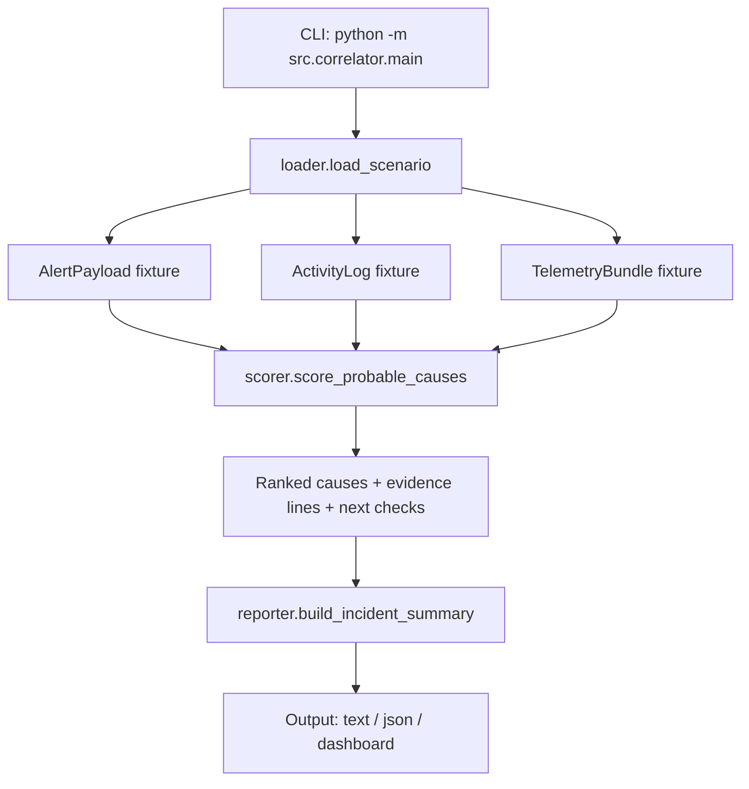
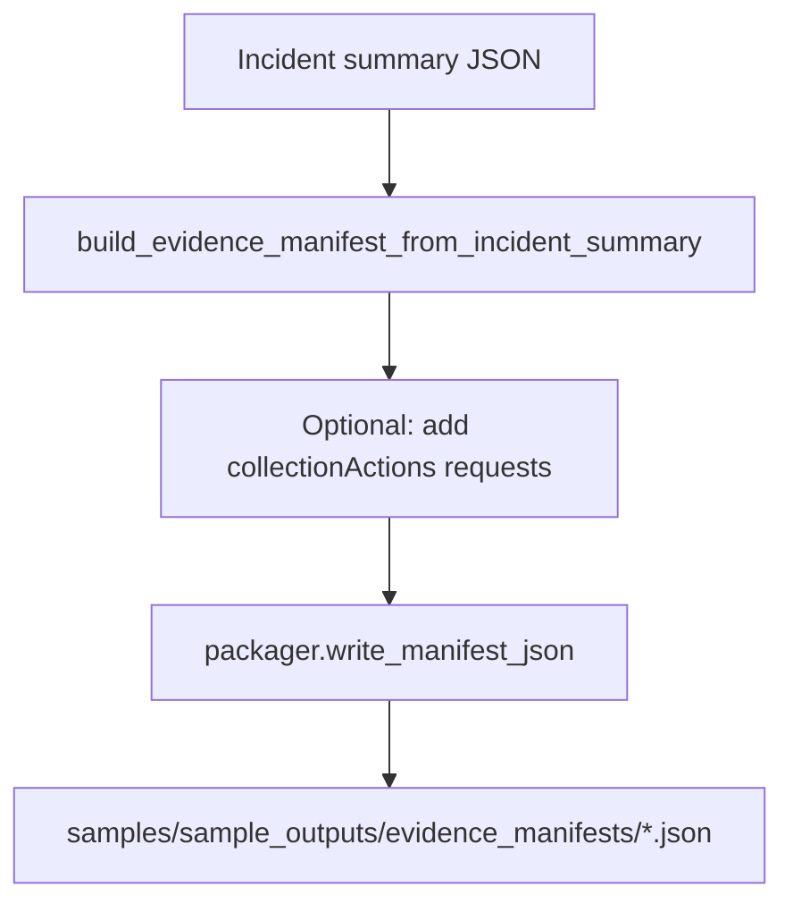
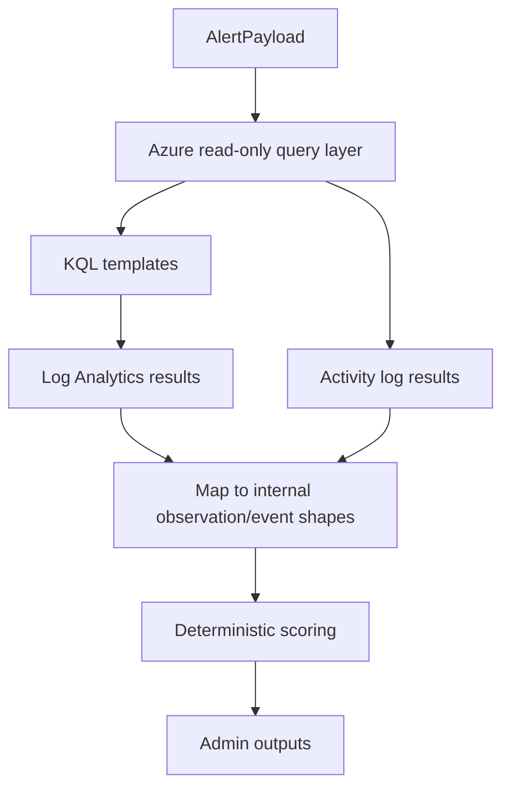

## Architecture (implemented MVP + forward path)

This document describes the **current implemented MVP architecture** and the next-step integration path. It focuses on **module responsibilities**, **data flow**, and the **safety model** (read-only / prepare-only).

### MVP outcome

Given a connectivity incident affecting **Azure VM → on-prem endpoint**, produce:

- a ranked list of probable causes with confidence
- supporting and counter evidence references
- administrator-oriented “next checks”
- optional compact JSON payload for future dashboards

### Current module architecture

The MVP is implemented as a small Python module set under `src/`:

- **`src/correlator/` (correlation engine)**
  - `main.py`: CLI entrypoint; orchestrates scenario load → scoring → rendering
  - `loader.py`: loads deterministic JSON fixtures from `samples/` and resolves scenario slugs
  - `scorer.py`: deterministic, rule-based scoring and confidence computation
  - `reporter.py`: renders output formats (`text`, `json`, `dashboard`) from the scored result
  - `models.py`: dataclasses/enums for alert, evidence, and report structures
- **`src/evidence/` (evidence scaffolding; prepare-only)**
  - `manifest.py`: evidence manifest model + safety notes + “recommended evidence” inference
  - `collectors.py`: creates “collection action requests” (packet capture, diagnostics script, connectivity tests) as data only
  - `packager.py`: writes evidence manifest JSON under `samples/sample_outputs/evidence_manifests/`
- **`src/integrations/` (Azure scaffolding; read-only placeholders)**
  - `config.py`: loads Azure settings from environment variables (optional in mock mode)
  - `azure_client.py`: mock-first client shape with explicit `NotImplementedError` for live calls
  - `kql_queries.py`: KQL query templates (placeholders; not executed live in MVP)

### Data flow: mock alert → incident summary

At runtime, the CLI reads a scenario’s fixtures and produces a report:

Key points:

- **Scenario source of truth** is `samples/` (fixtures are deterministic and safe).
- The scoring engine only considers evidence **within the incident time window**.
- Evidence references are intentionally human-traceable IDs:
  - activity events typically look like `act-*`
  - telemetry observations typically look like `obs-*`

### Evidence manifest flow (prepare-only)

Separately from the correlation report, the MVP includes a prepare-only “what to collect next” manifest. This is designed to be attached to an incident ticket or used by an operator without automating execution.

Safety properties:

- No PowerShell is executed by the Python layer.
- No packet capture is started by the Python layer.
- No live connectivity probes are executed by the Python layer.

### Future Azure read-only integration flow (Phase 2 scaffolding)

The repo includes placeholders for a read-only Azure integration path. The goal is to keep the same internal models while swapping the evidence source from fixtures to live queries.

Current state:

- `AzureClient.authenticate`, `query_log_analytics`, and `get_activity_logs` intentionally raise until implemented.
- Configuration is read from environment variables, but **absence is acceptable in mock mode**.

### Security and access assumptions

- No secrets are stored in the repository.
- Future Azure integration should remain **read-only** and least-privilege (e.g., Log Analytics Reader + activity log read) until the operational model is validated.

### Non-goals (current MVP)

- Automated remediation or any write actions to Azure/on-prem devices
- Continuous/streaming incident processing
- Multi-tenant complexity and full topology discovery
